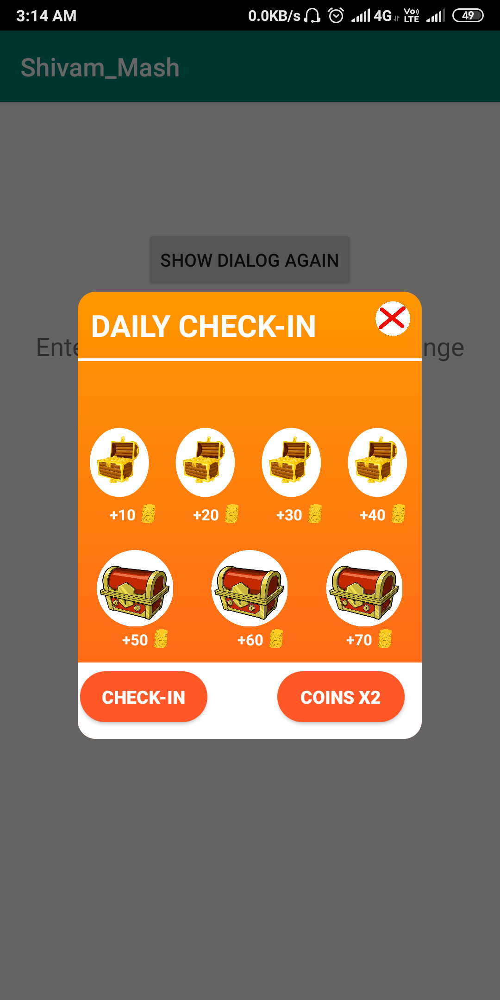
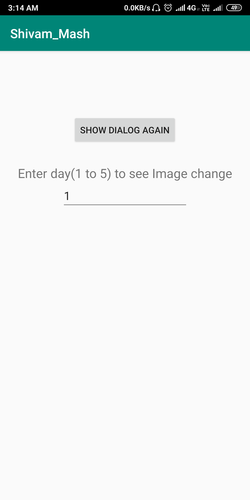

# Dialog_Animation
This is a simple application to display a DIALOG box at the starting of the application and change the images according to the login day value as explicitly mentioned by the user.

# Screenshots

#### This screen shows the dialog box in which user has logged continuously after a particular number of days

#### This is the main screen which gives an option to set the number of logged in days so as to set the images

